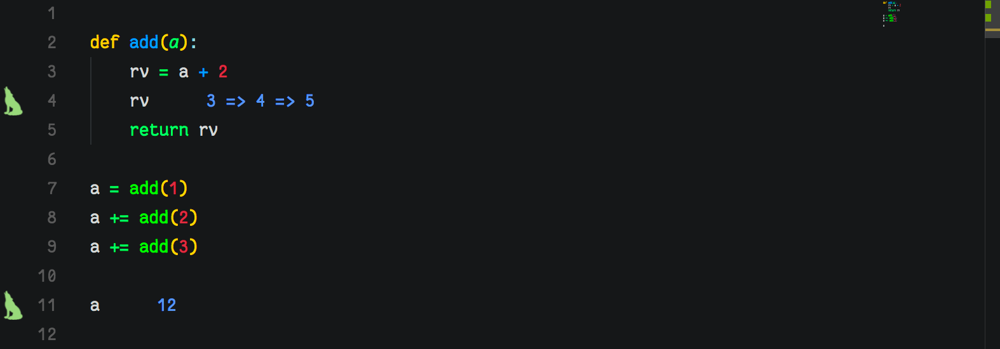
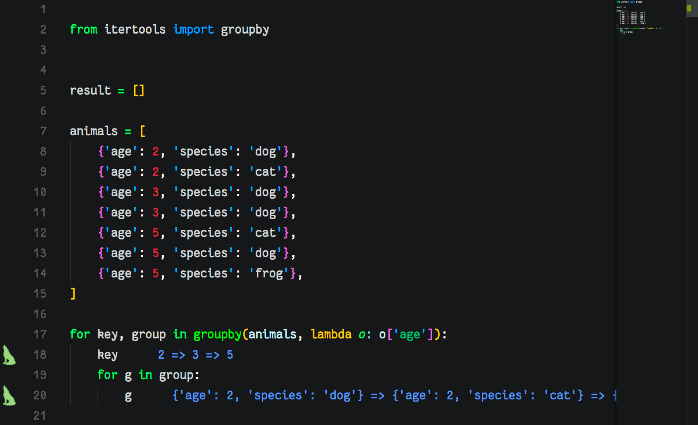
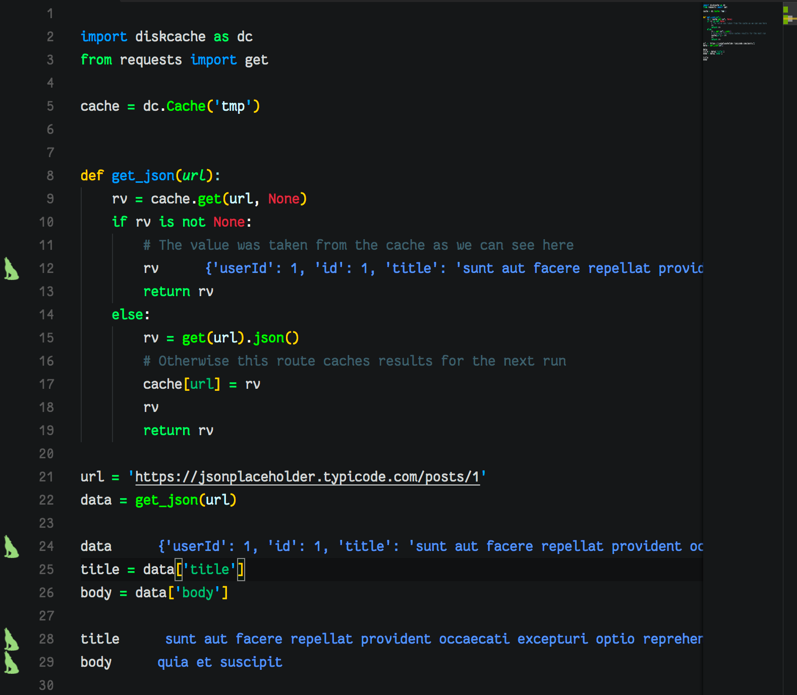

# Wolf - It kicks the Quokkas ass

Wolf is a VsCode extension that enables live inspection of Python code in the editor.

Wolf is Good for:

* Teachers
* Students
* Kids Who love to Code
* API testers
* Code Streamers
* Planet Earth

## Usage

Press `F1`, type `wolf`, and select `Wolf: Set the wolf on the current file.`

> PROTIP: Code annotations are updated on file save.

When done, press `F1` again, type wolf and select `Wolf: Stop all running wolves.`

## Features

**Check out variables inline!**

> NOTE: For this to work you must put only the variable
> name and not an expression; the annotations (16)
> cannot be edited.

Using a macro:

**Track variables inside of functions!**

**Works with loops!**

**And recursion!**

> NOTE: There are limits, for example this will not respond when `n > 10`
> on my PC, unless cached.

**Even works with http Requests!**

> NOTE: Please see FAQ section "Will APIs Hate Me?"
before making requests with Wolf.

## Requirements

* Python 3.6 <- This is currently a hard requirement
* `Hunter` library, available on
  PyPi.

> NOTE: If hunter is not found, you will be given the option to
> have it installed into to the "--user" directory automatically.
>
> ie: Wolf will perform `pip install hunter --user` in the cwd of
> the script.

## Extension Settings

This extension contributes the following settings:

* `wolf.barkAtCurrentFile`: Starts Wolf on the current file.
* `wolf.stopBarking`: Stops all running Wolf sessions.

## FAQ

### Can I have the text annotations in cornflower blue?

Abso-fucking-lutely.

### I don't see any annotations..

Make sure to save the file you're working on, and that Wolf is activated.
You can try stopping and starting Wolf again on the file to see if this
helps.

### The annotations are everywhere

Sorry, it's a feature for now. Try stopping and starting Wolf
from the command menu to clear the pesky buggers.

### Can my script have relative imports?

Yes. Sorry, I mean, HELL YES!

### Will APIs Hate Me?

That depends. If you code reponsibly and use something like
diskcache or redis to cache your calls, then you'll do just
fine out there. But if you decide to just bang away at some
API without some other sort of caching in place, then it's on
you my friend. Having said that, Wolf will only actually run
your code _on document save_. So you do get a small amount of
throttling by default.

Here's an example using [diskcache](https://pypi.python.org/pypi/diskcache/):

### Do you hate Quokka?

No, I love it. I set out to learn how to decorate text in vscode
and was looking for inspiration, I use Quokka all the time while
hacking away in JS land, and just really missed it when it came
to Python. So I set to work on a simple clone and initially thought
that I would hit a wall very quickly when it came to anything
more than simple regex based stuff in the global scope of the
script. I stumbled upon Hunter almost by accident (Back button
was blurred, so I must have opened it in a new tab.. Probably
reddit), there it was on PyPi with a screenshot _doing exactly
what I needed_. I spent a day on it tops so far and here we are
now. So, again, I love Quokka, and recommend it to everyone
using Javascript. But at the end of the day, the Wolf eats the Quokka.. ;)

### Wolf is stupid.. PDB is better

\*Cue Jingle

Honestly, if you need a real debugger, the one builtin to VSCode is
about as good as it gets. So really, please use that (or `pdb`, `ipdb`)
if you're in need of stuff like breakpoints (or if lives depend on it, ie
please don't use this to debug something like a drug pump ffs, ty).

I see Wolf as more of an exploration tool, for teachers or students
in a learning environment, and definitely for streamers.
You can't get any better than _live feedback next to the code you're editing_!

---

New Features
------------

**New in v0.0.2**

**Macros**

You can now use macros to turn on line annotations or
trigger features like timers, type converters, etc..
Macros are simply a 'hashtag' symbol, optionally
followed by a single character "tag", and placed at the
end of the line of code you wish to affect.

> Tags are used to customize the behavior of certain
macros.

Not all macros have tags; for example `Annotate` does
not have any, and can be used by itself on a line.

  - `#$` (Annotate)

> NOTE: Timers/converters coming soon..

Example:

**Auto evaluate print statements**

Wolf now automatically evaluates `print` statements/functions

Example:

----

## I found a bug

You mean a flea? Report any fleas in the issue tracker, please!

## Can I help

That would be awesome. You can shoot me an email or submit a PR. I'm also on
reddit at `/u/Duroktar`. Also, there's plenty of documentation to get started
on your own, if you just want to do that. Welcome one, welcome all!

## License

Wolf source is available under the Apache 2.0 Software license.
Any dependant libraries are subject to their own licenses and
terms, the most direct of which are listed below.

## Third Party Libraries

[Hunter](https://github.com/ionelmc/python-hunter) - Hunter is a flexible code tracing toolkit. (Honestly, I couldn't have made Wolf without this library.) - [BSD License](https://github.com/ionelmc/python-hunter/blob/master/LICENSE)
